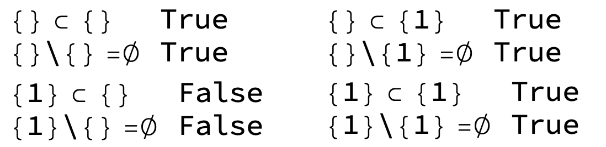

#### Brian Beckman

#### 4 Oct 2022


# ASR $\leftrightarrow$ AST


[LCompilers \[sic\] can produce ASR from many programming languages](https://github.com/lcompilers). Sometimes it's useful to go the other way. A whistle-stop along the way from ASR to any particular programming language is the [AST for that programming language](https://github.com/lcompilers). Here, we show several ways to produce [Python's well-documented AST](https://docs.python.org/3/library/ast.html), as realized in [LPython](https://lpython.org), one of the LCompilers, from ASR.


We'll write prototype our transformers in Clojure 1.11.1 because of its [world-class testing features](https://github.com/rebcabin/ClojureProjects002/tree/master/asr), amongst other superiorities. 


## Test Clojure


Run this notebook with the [clojupyter kernel](https://github.com/clojupyter/clojupyter).

```clojure
(= 42 (* 6 7))
```

Later, after they've been hardened, we'll rewrite our transformers in some LCompiler language, perhaps in [LPython](https://lpython.org), for high execution speed. LPython's generated code is often faster than that of C, C++, or Rust, but if it's not, we might rewrite in those languages. 


## Naming Convention<a id="naming-convention"></a>


In both directions, we replace PascalCase to kebab-case. For example, `IntegerBinOp` becomes `integer-bin-op`.


## Motivating Example: ASR fragment


From [this specification](https://github.com/lcompilers/libasr/blob/main/src/libasr/ASR.asdl), consider the following closed subset of productions or terms:

<!-- #raw -->
     ...
expr  = ...
      | IntegerConstant(int n, ttype type)
     ...
      | IntegerBinOp(expr left, binop op, expr right, ttype type, expr? value)
     ...
ttype = Integer(int kind, dimension* dims)
      | ...
     ...
binop = Add | Sub | Mul | Div | Pow | ...
dimension = (expr? start, expr? length)
<!-- #endraw -->

where `kind`, informally, is an exponent of 2 that indicates the number of bytes: one of 1, 2, 4, 8.


Just for fun, here are abstract semantics for the `expr` `2 + 3`. The presence of the optional `value` field is an optimization hint to the compiler: compute the answer at compile-time and produce the answer `5`. 


Notice that all the `dimension` tuples are empty; the constants are scalar constants, not array constants in this case. We'll tackle dimensions later, but not to get started.

```clojure
(def asr-frag 
    '(IntegerBinOp
      (IntegerConstant 2 (Integer 4 []))   ; expr  left
      Add                                  ; binop op
      (IntegerConstant 3 (Integer 4 []))   ; expr  right
      (Integer 4 [])                       ; ttype type
      (IntegerConstant 5 (Integer 4 [])))) ; expr? value
```

What's with the `#'user/` business? If you don't know, read the following Clojure Teaching Moments. 


## Clojure Teaching Moments


It's safe to skip this section.


Above, we `def`'d `frag`, but Clojure printed `#'user/frag`. What gives?


### Namespaces


First of all, the `user` part is an explicitly printed namespace. `user` is the default namespace. Clojure programs have an ambient namespace, so you need not write them explicitly. See [this guide to namespacees](https://clojure.org/guides/learn/namespaces). Namespaces are occasionally tricky.


### Metadata<a id="clojure metadata"></a>


See [this article](https://clojure.org/reference/metadata).


### Vars and Symbols.


Second of all, the #' is [reader syntax](https://clojure.org/reference/reader) for a Clojure `Var`. When you `def` a symbol, it gets [`bound`](https://clojure.org/reference/vars) and [`interned`](https://clojuredocs.org/clojure.core/intern). See [this stackoverflow question](https://stackoverflow.com/questions/11662084/why-does-clojure-distinguish-between-symbols-and-vars) and [this reference on Var](https://clojure.org/reference/vars). Clojure is more sophisticated and subtle than most other Lisps regarding symbols and values.


`frag` is a Clojure list:

```clojure
(type frag)
```

```clojure
(class frag)
```

So why does Clojure print `#'user/frag` after that `def` in cell `[2]`? Actually, `frag` just a symbolic name for a `Var` that contains the value:


`#'user/frag` is a Clojure Var:

```clojure
(type #'user/frag)
```

```clojure
(class #'user/frag)
```

The `Var` evaluates to itself:

```clojure
#'user/frag
```

```clojure
(eval #'user/frag)
```

To see inside, use `var-get`, [documented here](https://clojuredocs.org/clojure.core/var-get):

```clojure
(require '[clojure.pprint :refer [pprint]])
(pprint (var-get #'user/frag))
```

But you don't have to go through that rigmarole almost all the time, evaluating a free symbol (not a parameter or a `let` temporary) automatically gets the corresponding `Var`:

```clojure
(pprint frag)
```

### Commas Are Whitespace


Commas are whitespace in Clojure. We can use them or not, as we like.


This enables a clever notation for forward references. If you want to name a function but not implement it yet, write `(defn foo [args] ,,,)`.  Cute, huh?


## AST Grammar Fragment


From [LPython's AST in ASDL](https://github.com/lcompilers/lpython/blob/fabf0ec00353acaf25af14c4b76371eae46f5847/grammar/Python.asdl), consider these terms:

<!-- #raw -->
expr = ...
     | BinOp(expr left, operator op, expr right)
    ...
     | ConstantInt(int value, string? kind)
operator = Add | Sub | Mult | MatMult | Div | Mod | Pow ...
    ...  
<!-- #endraw -->

and `kind` is unspecified. We'll just guess it should be one of "i8", "i16", "i32", "i64", concrete integer kinds corresponding to ASR's abstract integer kinds 1, 2, 4, 8, respectively. 


## `ast-frag`: ASR $\rightarrow$ AST Hand Translation


Notice there is nothing in the AST to correspond to the result `ttype` nor to the `value` expr in the ASR. That's because the AST only represents _syntax_. `ttype` and `value` in the ASR are semantical. `ttype` is a code-generation constraint. `value` is an optimization hint to the compiler.


AST offers no place to save the semantics, making round-tripping impossible. We'll store semantical info in [clojure metadata](https://clojure.org/reference/metadata) for round-tripping. Here's our motivating example in LPython AST:

```clojure
(def ast-frag
     (with-meta
         '(BinOp
           (ConstantInt 2, "i32"),
           Add,
           (ConstantInt 3, "i32"))
         {:result-ttype "i32", 
          :value '(ConstantInt 5 "i32")}))
```

Check it:

```clojure
(require '[clojure.pprint :refer [pprint]])
(pprint (meta ast-frag))
```

# Automatic ASR $\rightarrow$ AST


## Echo, for Debugging

```clojure
(require '[clojure.pprint :refer [pprint]])
(defn echo [x]
    (pprint x) x)
```

## Grandma's Recursive-Descent Parser


Just the way our grandma taught us to do it. So 1970's! Every production in the ASR grammar corresponds to a function with a name in kebab-case according to [our naming convention](#naming-convention).


### `asr-s-exp`: Top-Level Dispatch


Let's call `s-exp`s the top-level productions in [this specification of ASR](https://github.com/lcompilers/libasr/blob/main/src/libasr/ASR.asdl). 
We'll want a function, `asr-s-exp`, that can parse any such `s-exp`.

```clojure
;; forward reference; backpatch later
(defn asr-s-exp [node] ,,,)
```

To get started, we're concerned with two `s-exp`s:
- expr
- ttype


Of the many alternatives for `expr` and `ttype`, we're concerned with the following to get started:

<!-- #raw -->
expr = (IntegerBinOp ...)
     | (IntegerConstant ...)
       
ttype = (Integer ...)
<!-- #endraw -->

Luckily, these alternatives can be distinguished by their heads, retrieved via Clojure's `first` built-in:

```clojure
;; forward references; backpatch later
(defn asr-expr  [node] ,,,)
(defn asr-ttype [node] ,,,)

(defn asr-s-exp
    [node]
    (case (-> node first #_echo)
        IntegerBinOp    (-> node asr-expr)
        IntegerConstant (-> node asr-expr)
        Integer         (-> node asr-ttype)
        #_"Add more here."))
```

### `asr-expr`: Sub-Case


This is just a mid-level dispatcher. It exists to mimic the ASR spec. Automatically generated parsers will certainly have this structure.

```clojure
(defn asr-expr-integer-bin-op   [node] ,,,)
(defn asr-expr-integer-constant [node] ,,,)

(defn asr-expr
    [node]
    (case (-> node first)
        IntegerBinOp    (-> node asr-expr-integer-bin-op)
        IntegerConstant (-> node asr-expr-integer-constant)
        #_"Add more here."))
```

### `asr-ttype`: Sub-Case


another obvious mid-level dispatcher.

```clojure
(defn asr-ttype-integer [node] ,,,)

(defn asr-ttype
    [node]
    (case (-> node first)
        Integer (-> node asr-ttype-integer)
        #_"Add more here."))
```

TODO: Generate the parsers from the ASDL grammar for AST, to future-proof the parsing.


TODO: the transformation to AST is hard-coded. We will want other transformations. Abstract over the transformations, making them pluggable.


### Translations for Informal Kinds


Because `kind` is informally specified in ASR (there is no production for `kind` on the left-hand side of a specification in ASDL), we'll write the translation without a recursive-descent parser for the `kind` node.

```clojure
(def asr->ast-kind-map
    {4 "i32", 1 "i8", 2 "i16", 8 "i64"})
```

### Translation of `ttype-integer`

```clojure
(defn asr-ttype-integer
    "Example: (Integer 4 []) ~~~> \"i32\""
    [node]
    (let [[signum, kind, & dims] 
          node] ; destructuring
        (assert (= signum 'Integer))
        (assert (not (empty? dims)))
        (assert (#{1 2 4 8} kind))
        (-> kind asr->ast-kind-map)
        ;; TODO: dimensions
        ))
```

### Translation of `expr-integer-constant`

```clojure
(defn asr-expr-integer-constant 
    "Example: (IntegerConstant 42 (Integer 4 [])) ~~~> 
    (ConstantInt 42 \"i32\")"
    [node]
    (let [[signum, value, ttype] 
          node] ; destructuring
        (assert (= signum 'IntegerConstant))
        (assert (int? value))
        (list 'ConstantInt
              value
              (-> ttype asr-ttype))))
```

### Translation of `binop`


Note that ASR `Mul` maps to AST `Mult`

```clojure
(def asr->ast-binop-map
    {'Add 'Add, 'Mul, 'Mult, 'Sub 'Sub, 'Div 'Div #_"Add more here."})
```

```clojure
(defn asr-binop 
    [node]
    (-> node asr->ast-binop-map))
```

### Translation of `expr-integer-bin-op`

```clojure
(defn asr-expr-integer-bin-op
    "Example: (IntegerBinOp
     (IntegerConstant 2 (Integer 4 []))  ; left
     Add                                 ; binop
     (IntegerConstant 3 (Integer 4 []))  ; right
     (Integer 4 [])                      ; ttype
     (IntegerConstant 5 (Integer 4 []))) ; value?
     ~~~> 
     (with-meta (BinOp (ConstantInt 2 \"i32\") 
                   Add (ConstantInt 3 \"i32\")))
                {:result-type \"i32\", 
                 :value (ConstantInt 5 \"i32\")}"
    [node]
    (let [,[signum, left, binop, right, ttype, & value?] node
          ,result-ttype {:result-ttype (-> ttype asr-ttype)}]
        (assert (= signum 'IntegerBinOp)) ;; TODO: consider a signum hashmap.
        (with-meta (list 'BinOp
                         (-> left  asr-expr)
                         (-> binop asr-binop)
                         (-> right asr-expr)) 
            (if value? 
                (merge result-ttype
                       {:value (-> value? first asr-expr)})
                result-ttype))))
```

### Unit Testing the Motivating Example

```clojure
(-> asr-frag asr-s-exp pprint)
(-> asr-frag asr-s-exp meta pprint)
(let [xf (-> asr-frag asr-s-exp)]
    (-> xf meta pprint))
```

```clojure
(assert (-> (= ast-frag (-> asr-frag asr-s-exp)) 
            echo))
```

### Unit Testing a Bigger Example


From [this project](https://github.com/rebcabin/ClojureProjects002/blob/master/asr/test/asr/core_test.clj). Clojure doesn't much care whether our input is a vector (in square brackets) or a list (in round brackets). This example was hand-written as a vector for obscure reasons, and I was too lazy to change some of the square brackets to round brackets. It works fine; don't worry about it.

```clojure
(def bigger-asr-frag 
    '[IntegerBinOp
        [IntegerConstant 2 (Integer 4 [])]
        Add
        [IntegerBinOp ; recursive right
         [IntegerConstant 3 (Integer 4 [])]
         Add
         [IntegerConstant 5 (Integer 4 [])]
         (Integer 4 [])]
        (Integer 4 [])
        [IntegerBinOp
         [IntegerConstant 3 (Integer 4 [])]
         Mul
         [IntegerConstant 4 (Integer 4 [])]
         (Integer 4 [])
         [IntegerConstant 12 (Integer 4 [])]]])
(-> bigger-asr-frag
    asr-s-exp
    pprint) ;; Check out the recursive right.
(-> bigger-asr-frag
    asr-s-exp
    meta
    pprint) ;; Check out the recursive answer.
(-> bigger-asr-frag
    asr-s-exp
    meta
    :value
    meta
    pprint) ;; Check out the value of the recursive answer.
```

# Automatic AST $\rightarrow$ ASR


## Grandma's Way, Again


If you understood ASR $\rightarrow$ AST, then the following needs little explanation. Every production in the AST grammar corresponds to a function with a name in kebab-case according to [our naming convention](#naming-convention). To get started, it's limited to our motivating example and recursive extensions of it. [The normative, ruling referece grammar is here](https://github.com/lcompilers/lpython/blob/fabf0ec00353acaf25af14c4b76371eae46f5847/grammar/Python.asdl).


According to [our naming convention](#naming-convention), AST's `BinOp` becomes `bin-op`, whereas ASR's `binop` stays `binop`.


### AST Binop Map

```clojure
(require '[clojure.set :as set])
(def ast->asr-bin-op-map
    (-> (set/map-invert asr->ast-binop-map) echo))
```

### AST Type Map

```clojure
(def ast->asr-ttype-map
    {"i32" '(Integer 4 []), "i8"  '(Integer 1 []),
     "i16" '(Integer 2 []), "i64" '(Integer 8 [])})
```

### AST BinOp

```clojure
(defn ast-bin-op
    [node]
    (-> node ast->asr-bin-op-map))
```

### AST Signum Map

```clojure
(def ast->asr-signum-map
    {'ConstantInt 'IntegerConstant,
     'BinOp       'IntegerBinOp
     #_"Add more here."})
```

### AST Expr: BinOp

```clojure
(defn ast-expr [node] ,,,)

(defn ast-expr-bin-op
    [node]
    (let [,[signum, left, bin-op, right] node
          ,{:keys [result-ttype value]} (-> node meta #_echo)
          ,prefix
          (list 
           (-> signum       ast->asr-signum-map)
           (-> left         ast-expr)
           (-> bin-op       ast-bin-op)
           (-> right        ast-expr)
           (-> result-ttype ast->asr-ttype-map))]
        (-> (if value
                (concat prefix [(-> value ast-expr)])
                prefix) 
            #_echo)))
```

### AST ConstantInt

```clojure
(defn ast-expr-constant-int
    [node]
    (let [[signum, value, ast-type] node]
        (assert (int? value))
        (list
         (-> signum ast->asr-signum-map)
         value
         (-> ast-type ast->asr-ttype-map))))
```

### AST Expr

```clojure
(defn ast-expr 
    [node] 
    (case (-> node first)
        BinOp       (-> node ast-expr-bin-op)
        ConstantInt (-> node ast-expr-constant-int)
        #_"Add more cases here"))
```

### AST S-Exp

```clojure
(defn ast-s-exp 
    [node]
    (case (-> node first)
        BinOp       (-> node ast-expr)
        ConstantInt (-> node ast-expr)
        #_"Add more cases here"))
```

### Unit Testing the Motivating Example

```clojure
(assert 
 (-> (= asr-frag 
        (-> asr-frag 
            asr-s-exp 
            ast-s-exp))
     echo))
```

### Unit Testing a Bigger Example

```clojure
(assert 
 (-> (= bigger-asr-frag 
        (-> bigger-asr-frag 
            asr-s-exp 
            ast-s-exp))
     echo))
```

# (Much) More Sophisticated Parsers (UNDONE)


Recursive descent may be all we need, especially if we generate it off the ASDL. But if they get big, slow, or ugly, there are lots of ways out.


We'll go after this with Alex's [tree walker, article here](https://insideclojure.org/images/j-treevisit-pdf.pdf), unpacked in [the DIGRESSION](#drill-down). Another alternative is via instaparse, [explored for test generation here](https://github.com/rebcabin/ClojureProjects002/tree/master/asr).


# DIGRESSION: Alex's Tree Walker Article<a id="drill-down"></a>


We may use this stuff to walk the ASR and AST trees. Several ways: 

- via recursive clojure.walk, consuming stack

- via iterative zippers, not consuming stack

- via a Tree Visitor abstraction and zippers


You'll need [Alex's article](https://insideclojure.org/images/j-treevisit-pdf.pdf) open to understand this section.


## Alex's Node Validation

```clojure
(require '[clojure.set :as set])
```

```clojure
(defn- hashmap-keys-included-in? 
       "Check that the _set_ of keys in a hashmap
       is a subset of an expected set. The map may 
       not have extraneous keys, but need not 
       have all the expected keys."
       [hashmap maximal-key-set]
       (not 
        (seq ; converts empty set #{} to nil
         (set/difference ; equivalent to subset test
          (set (keys hashmap)) ; the subset
          maximal-key-set)))) ; the superset
```

[Set difference is equivalent to subset-ness](https://math.stackexchange.com/questions/1916036/does-showing-that-the-difference-of-two-sets-is-empty-imply-that-they-are-equal). Iff $A\subset{}B$, then $A-B=\emptyset$. Here are the edge cases:


</img>


## Alex's Node Construction


This is a lot like `@dataclass` in Python: it's a constructor-constructor. Read the docstrings.

```clojure
(defmacro defnode
    "Create a constructor function for a typed map 
    and a set of user-supplied fields (which are 
    validated). Constructor will be 
    (defn <new-&node-type> [field-map]). The :type
    field of a node equals its node-type. That 
    convention is followed by all the examples."
    [node-type [& fields]]
    (let [constructor-name# (symbol (str "new-" node-type))]
        `(defn ~constructor-name# 
             [nv-map#]  
             ;; Precondition: check that arguments ...
             {:pre [(map? nv-map#)  ; ... are a map and are a ...
                    (hashmap-keys-included-in? 
                     nv-map#        ; ... subset of the fields.
                     ~(set (map keyword fields)))]}
             (assoc nv-map# 
                    :type (keyword '~node-type)))))
```

## Alex's Node Types


There is some harmless re-use of Clojure keywords like `concat`, `filter`, `type`, and `name` in the names of nodes and fields. I won't bother to refactor this because it does not cause problems.

```clojure
(defnode column           [table column])
(defnode compare-criteria [left right])
(defnode concat           [args])
(defnode filter           [criteria child])
(defnode join             [type left right])
(defnode project          [projections child])
(defnode table            [name])
(defnode value            [value])
```

Watch the next cell succeed, where we pass in an empty hashmap. Note the system-supplied `:type` field. 

```clojure
(new-concat {})
```

Watch the next cell fail validation of the precondition because we pass in unexpected keys --- keys that don't match the fields specified in the call of `defnode`.

```clojure
(new-concat {:args ["a" "b"], :barf 'barf})
```

## Alex's Listing 7: Eval-Concat


Debugging: replaced `(left right)` with `[left right]`. Ditched gratuitous `node-type` function in lieu of `:type`, which is already a function. That is too much abstraction IMO.

```clojure
(require '[clojure.string :as string])
(defmulti  eval-concat :type)
(defmethod eval-concat :default [node] node)
(defmethod eval-concat :concat [concat]
    (let [arg-eval (map eval-concat (:args concat))]
        (if (every? string? arg-eval)
            (string/join arg-eval)
            (new-concat {:args arg-eval}))))
(defmethod eval-concat :compare-criteria 
    [{:keys [left right] :as crit}]
    (new-compare-criteria 
     {:left (eval-concat left)
      :right (eval-concat right)}))
```

## Alex's Listing 8: Example Usage


This is the result of the transformation:

```clojure
(def concat-ab (new-concat {:args ["a" "b"]}))
(def crit (new-compare-criteria 
           {:left concat-ab
            :right "ab"}))
(eval-concat crit)
```

This is the input to the transformation:

```clojure
(pprint crit)
```

## Alex's Listing 10: via Postwalk


Abstracts the explicit recursion in Listing 8.

```clojure
(require '[clojure.walk :as walk])

(defn eval-concat 
    [node]
    (if (and (= :concat (:type node))
             (every? string? (:args node)))
        (string/join (:args node))
        node))

(defn walk-example
    [node]
    (walk/postwalk eval-concat node))
```

```clojure
(walk-example crit)
```

## Alex's Listing 12: Zippers

```clojure
(require '[clojure.zip :as zip])
(def vz "example" 
    (zip/vector-zip [:compare [:concat "a" "b"] "ab"]))
;; exercises; Asserts don't work. Don't know why not.
(println (zip/node (zip/down vz)))
;>>> :concat
(println (zip/rights (zip/down vz)))
;>>> ([:concat a b] ab)
(println (zip/node (zip/right (zip/down vz))))
;>>> [:concat a b]
(println (zip/node (zip/down (zip/right (zip/down vz)))))
;>>> :concat
```

### `recur` Means "iterate"


iterative walk, as opposed to the prior recursive walk; `recur` implements tail-recursion, which is just `goto`. See [this classic article](https://dl.acm.org/doi/10.1145/800179.810196) and [these examples](https://clojuredocs.org/clojure.core/loop).

```clojure
(defn tree-edit [zipper matcher editor]
    (loop [loc zipper] ;; iterative, tail-recursive
        (if (zip/end? loc)
            (zip/root loc) ;; Apply changes. Return new tree.
            (if-let [matcher-result (matcher (zip/node loc))]
                (recur (zip/next 
                        (zip/edit 
                         loc 
                         (partial editor matcher-result))))
                (recur (zip/next loc))))))
```

## Alex's Listing 14: Tree-Zipper Support


A zipper needs three functions. Quoting Alex's paper:

* `branch?` takes a node and returns whether it’s possible for that node to have children.

* `children` takes a node and returns the children of that node.

* `make-node` takes a node, a new set of children, and returns a new node instance.


Here are some generally useful tree zipper support functions, for trees based on vectors, hashmaps, and lists.

```clojure
(defmulti tree-branch? class)
(defmethod tree-branch? :default [_] false)
(defmethod tree-branch? clojure.lang.PersistentVector [v] true)
(defmethod tree-branch? clojure.lang.PersistentArrayMap [m] true)
(defmethod tree-branch? clojure.lang.PersistentList [l] true)

(defmulti tree-children class)
(defmethod tree-children clojure.lang.PersistentVector [v] v)
(defmethod tree-children clojure.lang.PersistentArrayMap [m] (seq m))
(defmethod tree-children clojure.lang.PersistentList [l] l)

(defmulti tree-make-node (fn [node children] (class node)))
(defmethod tree-make-node clojure.lang.PersistentVector 
    [v children]
    (vec children))
(defmethod tree-make-node clojure.lang.PersistentArrayMap 
    [m children]
    (apply hash-map (apply concat children)))
(defmethod tree-make-node clojure.lang.PersistentList 
    [_ children]
    children)
```

```clojure
(defn tree-zipper 
    "Construct a tree zipper for vectors, hashmaps, and lists."
    [node]
    (zip/zipper 
     tree-branch? 
     tree-children 
     tree-make-node node))
```

## Alex's Listing 15

```clojure
(defn can-simplify-concat 
    "matcher function for tree.edit"
    [node] 
    (and (= :concat (:type node))
         (every? string? (:args val))))

(defn simplify-concat 
    "editor function for tree-edit"
    [_ node]
    (string/join (:args node)))

(defn simplify-concat-zip [node]
    (tree-edit (tree-zipper node)
               can-simplify-concat
               simplify-concat))

(simplify-concat-zip crit)

```

## Alex's Listing 16


Debugged: `:keys` form needs a vector; paper has a list.

```clojure
(defn visit-node
    "Visit a node, using an internal control hashmap
    to stop or skip early."
    [start-node start-state visitors]
    ;; destructuring, like "let"
    (loop [node                            start-node 
           state                           start-state
           [first-visitor & rest-visitors] visitors]
        ;; Define the shape of a hashmap that gets threaded around.
        (let [context (merge 
                       {:node  node, 
                        :state state, 
                        :stop  false, 
                        :next  false} ; means "skip"
                       (first-visitor node state))
              {new-node  :node
               new-state :state
               :keys [stop next]} context]
            (if (or next stop (nil? rest-visitors))
                {:node new-node, :state new-state, :stop stop}
                (recur new-node new-state rest-visitors)))))

(defn tree-visitor
    ([zipper visitors] ;; arity-2 version of "tree-visitor"
     (tree-visitor zipper nil visitors))
    ([zipper initial-state visitors] ;; arity-3 version
     (loop [loc zipper
            state initial-state]
         (let [context 
               (visit-node (zip/node loc) state visitors)
               new-node  (:node  context)
               new-state (:state context)
               stop      (:stop  context)
               new-loc   (if (= new-node (zip/node loc)) ; zip API
                             loc ; else ...
                             (zip/replace loc new-node)) ; zip API
               next-loc  (zip/next new-loc)]
             (if (or (zip/end? next-loc) (= stop true))
                 ;; done ...
                 {:node (zip/root new-loc), :state new-state}
                 ;; else ...
                 (recur next-loc new-state))))))
```

## Alex's Listing 17: String Finder

```clojure
(defn string-visitor
    [node state]
    (when (string? node)
        {:state (conj state node)}))

(defn string-finder 
    [node]
    (:state
     (tree-visitor ; arity-3 version
      (tree-zipper node)  ; zipper
      #{}                 ; initial-state
      [string-visitor]))) ; visitor(s)
```

## Alex's Listing 18: Node Finder


Debugged: `of-type` is missing.

```clojure
(defn of-type
    [node type]
    (= (:type node) type))

(defn matched 
    [type node state]
    (when (of-type node type)
        {:stop true, :state node}))

(defn find-first 
    [node type]
    (:state
     (tree-visitor  ; arity-2 version
      (tree-zipper node)          ; zipper
      [(partial matched type)]))) ; visitor(s)
```

## Alex's Listing 19: Multiple Visitors

```clojure
(defn on 
    [type]
    (fn [node state]
        (when-not (of-type node type)
            {:jump true})))

(defn all-strings 
    []
    (fn [{args :args} _]
        (when-not (every? string? args)
            {:jump true})))

(defmulti  eval-expr :type)
(defmethod eval-expr :default [x] x)
(defmethod eval-expr :concat 
    [{args :args :as node}]
    (string/join args))
(defmethod eval-expr :compare-criteria 
    [{:keys [left right] :as node}]
    (if (= left right) 
        true 
        node))

(defn node-eval 
    [node state]
    {:node (eval-expr node)})

(defn chained-example 
    [node]
    (:node (tree-visitor ; arity-2 version
            (tree-zipper node)                     ; zipper
            [(on :concat) (all-strings) node-eval] ; vistors
            )))
```

```clojure
(chained-example crit)
```

# Appendix: Sandbox

```clojure
(pprint `(TranslationUnit 
          (SymbolTable 
           1 
           {:_lpython_main_program 
            (Function 
             (SymbolTable 4 {}) 
             _lpython_main_program [] 
             [(SubroutineCall 1 main0 () [] ())] 
             () Source Public Implementation 
             () .false. .false. .false. .false. .false. 
             [] [] .false.), 
            :main0 
            (Function 
             (SymbolTable 
              2 
              {:x (Variable 2 x Local () () Default (Integer 4 []) 
                            Source Public Required .false.), 
               :x2 (Variable 2 x2 Local () () Default (Integer 8 []) 
                             Source Public Required .false.), 
               :y (Variable 2 y Local () () Default (Real 4 []) 
                            Source Public Required .false.), 
               :y2 (Variable 2 y2 Local () () Default (Real 8 []) 
                             Source Public Required .false.)}) 
             main0 [] 
             [(= (Var 2 x) 
                 (IntegerBinOp 
                  (IntegerBinOp 
                   (IntegerConstant 2 (Integer 4 [])) 
                   Add 
                   (IntegerConstant 3 (Integer 4 [])) 
                   (Integer 4 []) 
                   (IntegerConstant 5 (Integer 4 []))) 
                  Mul 
                  (IntegerConstant 5 (Integer 4 [])) 
                  (Integer 4 []) 
                  (IntegerConstant 25 (Integer 4 []))) 
                 ()) 
              (Print () [(Var 2 x)] () ())]
             () Source Public Implementation 
             () .false. .false. .false. .false. .false. 
             [] [] .false.), 
            :main_program
            (Program 
             (SymbolTable 3 {}) 
             main_program [] 
             [(SubroutineCall 1 _lpython_main_program () [] ())])
            }) []))
```

```clojure

```
